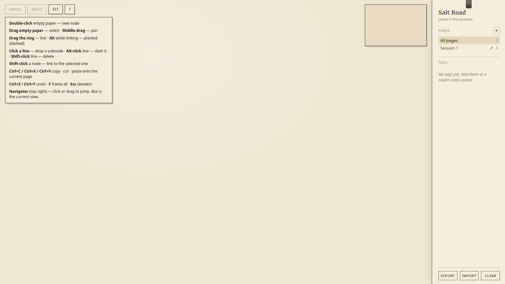
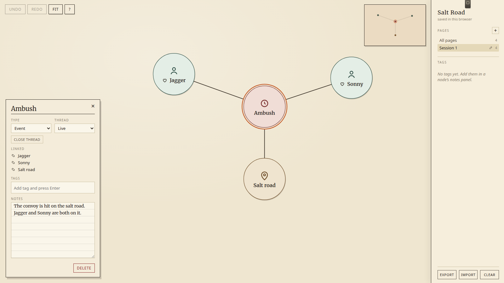
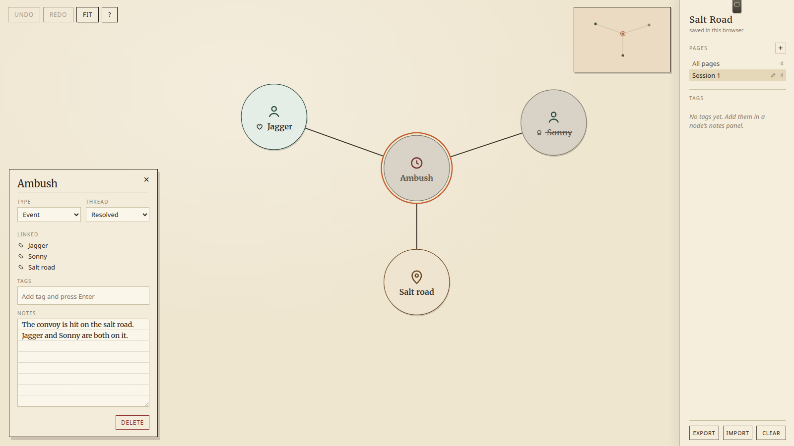
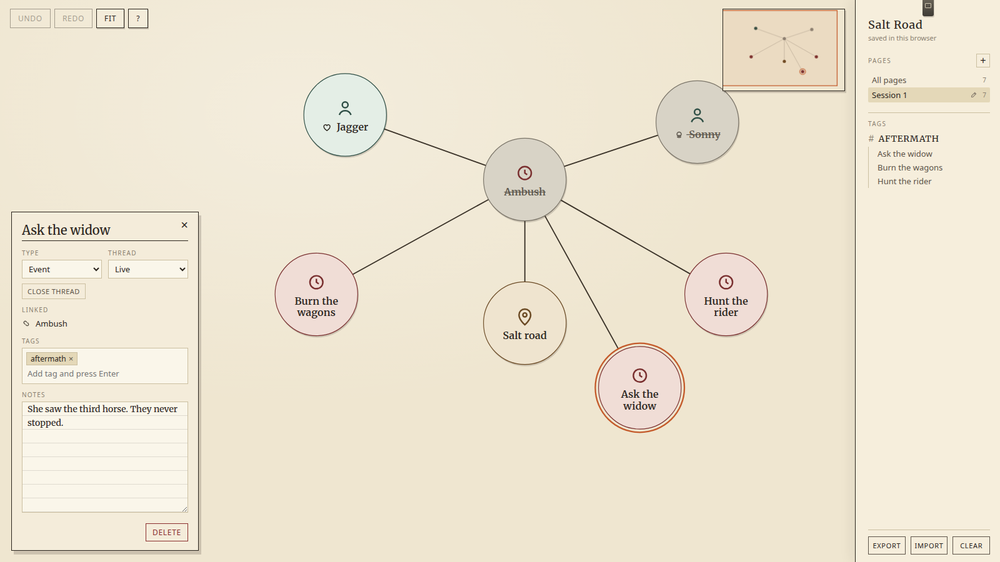
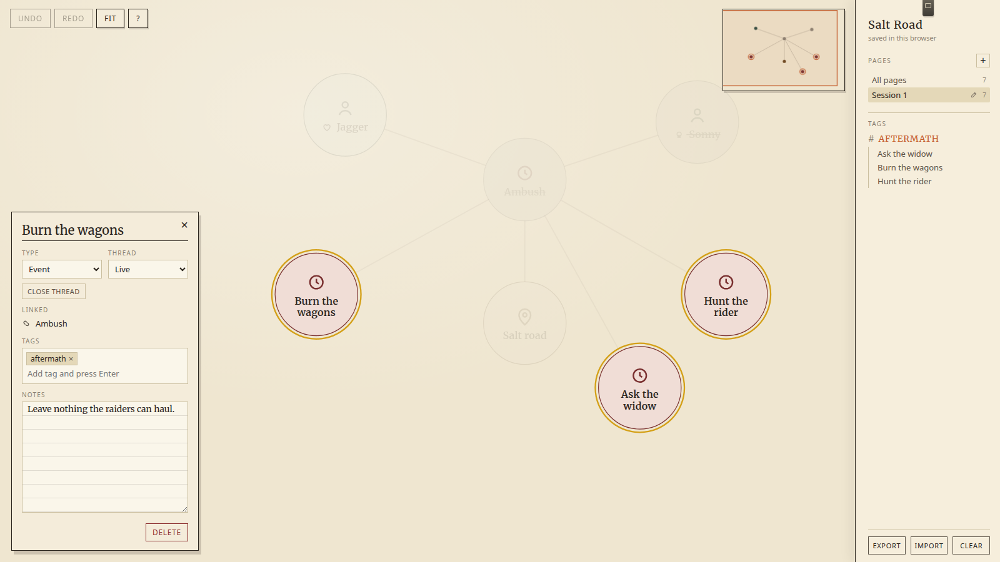
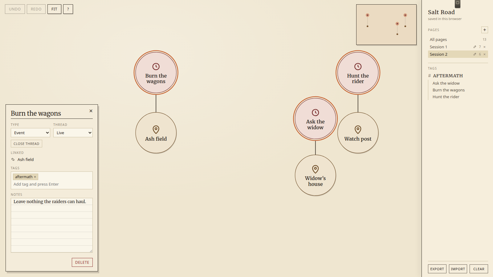
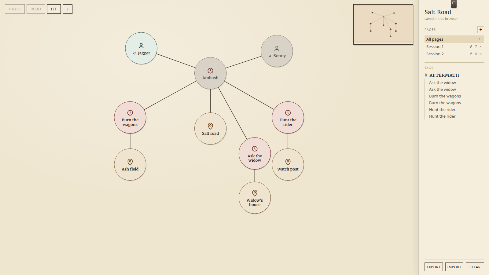

# Prep Map

A sheet of paper for campaign prep. Characters, places, events, the thread you planted three sessions ago and forgot.

Desktop browser. Wide window. Nothing leaves the machine — close the tab, open it next week, the board is still there. Phone will just tell you to use a bigger screen. That’s on purpose.

Four files: `index.html`, `styles.css`, `app.js`, this. No install, no login, no cloud.

---

## Get in

Double-click `index.html`. Or drop the folder on GitHub Pages / Netlify / `python3 -m http.server` if you want a URL.

Click the title in the right rail and name the campaign. Export uses that name.

After a Clear, add `?demo=1` to the URL for a dense sample board, or `?story=1` … `?story=7` to walk the campaign below.

Press **?** any time for the cheat sheet.

---

## A session, start to finish

### 1. Empty paper, help open

Wheel zooms toward the cursor. Middle-mouse, right-mouse, or **Space + drag** pans. The navigator in the top-right is empty until something lives on the page.

Double-click empty paper. That’s a node.

*First open. Help sheet, navigator, pages rail. Double-click the page.*

### 2. Put a cast on the table

Two characters, an event, a place. Drag the **ring** of A onto B, or select A and **Shift-click** B.

Click the event. The notes sheet docks bottom-left. Type what the table needs to hear.

*Ambush is live. Notes are on the sheet. Jagger and Sonny are both on the road.*

### 3. The event fires. Someone doesn’t walk away

Thread is “is this still in play?”, not “is this NPC dead”.

- **Close thread** (or set Thread → Resolved). The disc greys. The name is crossed.
- On a character, Condition → Dead. A skull mark. The disc colour does not change unless you also close their thread.

*Ambush is resolved. Sonny is dead. Jagger is still alive. The notes stay.*

### 4. Three forks off the same event

New events, each linked back to Ambush. Same tag on all three — type `aftermath`, Enter.

The rail lists **#AFTERMATH** and the three names.

*Burn the wagons. Hunt the rider. Ask the widow. One tag, three doors.*

### 5. Click the tag

Click **#AFTERMATH** in the rail.

Those nodes become a selection — same as a marquee box. Drag one, they all move. **Ctrl+C** copies the set and the links between them. The rest of the board and its lines fade hard so the group is the only thing you can see.

Click the header again to drop the highlight (the selection stays). Click a name under the tag to jump to that node.

*Tag click = group select. Dimmed nodes and lines step back.*

### 6. Next session, same events, new ground

**+** in Pages. That’s Session 2, empty, already framed.

The three events are still on the clipboard. **Ctrl+V** on a *different* page pastes them **in place** — same coordinates as Session 1, so they will stack when you look at All pages. (Paste on the *same* page still lands under the cursor, so you don’t cover the originals.)

Add a location for each event. Link it.

*Session 2 only. The three events came across. Ash field, Watch post, Widow’s house are new.*

### 7. All pages

Click **All pages**. Session 1 and Session 2 occupy the same paper.

The pasted events sit exactly on their Session 1 twins. The new locations take the free space underneath, so nothing from Session 1 is covered.

*One map, two sessions. Events stack. Places don’t fight.*

---

## Core features

| What | How |
|---|---|
| Infinite paper | Wheel zooms toward the cursor. Middle / right / **Space + drag** pans. |
| Nodes | Double-click paper. Drag the body to move. Click body → select + notes. Double-click body → rename. |
| Two sizes | Big disc = person / place / event / faction / note. Small pill = beat on a line. |
| Links | Drag the **ring** of A onto B, or select A and **Shift-click** B. |
| Planted links | Hold **Alt** while linking, or **Alt-click** a line later. Dashed. |
| Subnodes | Click a line. Already tied to both ends. |
| Notes sheet | Bottom left. Title, type, thread, condition, linked names, tags, notes. **×** closes it. |
| Tags | Type in the sheet, Enter. Click the rail header to select every member (move / copy / paste / delete as a group) and fade the rest. |
| Pages | One sheet per session, plus **All pages**. |
| Paste across pages | Onto a *new* page: same world position. Onto the *same* page: under the cursor. |
| Thread | Live / Resolved / Missed / Rumor / Ghost. Visual, not a delete. |
| Condition | Alive / Missing / Compromised / Dead — characters only. |
| Navigator | Tiny map, top-right. Dots are nodes, orange box is the view. |
| Persistence | Every change writes to this browser. Refresh restores. |
| Backup | **Export** JSON named after the map. **Import** replaces the open board. **Clear** wipes; Undo will not bring a Clear back. |

---

## Keybinds and controls

| Input | Action |
|---|---|
| Double-click empty paper | New node |
| Double-click a node | Rename in place |
| Click a node body | Select and open the notes sheet |
| Drag a node body | Move (a multi-selection moves as a pack) |
| Drag empty paper | Selection box |
| Drag the **ring** | Start a link (rubber-band follows the cursor) |
| Drop the ring on another node | Finish the link |
| Click empty paper while linking | Cancel the rubber-band |
| **Shift-click** a node | Link it to the current selection |
| **Alt** while linking | Planted (dashed) link |
| Click a line | Drop a subnode on it |
| **Alt-click** a line | Toggle planted / solid |
| **Shift-click** a line | Delete the line |
| Wheel | Zoom toward cursor |
| Middle-drag / right-drag | Pan |
| **Space + drag** | Pan |
| Click / drag the navigator | Jump the view |
| Click a tag header | Select every member, fade the rest |
| Click a name in the rail | Focus that node and open notes |
| Click **×** on the notes sheet | Close it |
| **F** or Fit | Frame everything on the current page |
| **?** | Cheat sheet |
| **Esc** | Drop a half-drawn link, a selection, or the help sheet |
| **Ctrl+Z** / **Ctrl+Y** | Undo / redo |
| **Ctrl+C** / **Ctrl+X** / **Ctrl+V** | Copy / cut / paste |
| **Delete** / **Backspace** | Delete the selection |
| Undo / Redo / Fit / ? | Top-left buttons, same as the keys |

If you’re typing in a field, the keys stay with the field.

---

## Full list of features

### Canvas

- Semi-endless paper.
- Zoom toward the mouse wheel.
- Pan with middle mouse, right mouse, or Space-drag.
- Selection marquee on empty paper.
- Weak repulsion so a new node doesn’t land on an old one.
- Multi-select drag moves the pack.
- Fit / **F** frames the current page (switching pages does this for you). Fit leaves room for an open notes sheet.
- Mini-map navigator: node dots + current-view box.
- Desktop-only gate on a narrow window.

### Nodes

- Create by double-click on empty paper.
- Rename by double-click on the node, or in the notes sheet.
- Types: Character, Location, Event, Faction, Note — icon and fill per type.
- Two visual sizes: large discs and small line-pills (subnodes).
- Drag the body to reposition. A selected group moves together.
- Click body selects and opens the inspector.

### Thread and condition

- **Live** — still in the stew.
- **Resolved** — grey fill, name crossed. **Close thread** does this without deleting.
- **Missed** — gold ring. The fork the table didn’t take.
- **Rumor** — dashed outline, hatched fill. Heard, not known.
- **Ghost** — empty dashed ring. A name nobody will say.
- Character **condition** is a separate mark: alive, missing, compromised, dead.
- Condition does not override type colour. Thread does not mean “the NPC died.”

### Links

- Ring-drag from A to B with a live rubber-band.
- Shift-click from a selected node to another.
- Direct line with no subnode is allowed.
- Click the line to insert a subnode already tied to both ends.
- Alt while creating, or Alt-click later, marks a planted (dashed) support.
- Shift-click a line deletes it.
- Esc or a click on empty paper kills a half-drawn rubber-band.
- Edges render under nodes.

### Notes sheet

- Docks bottom-left; **×** closes it.
- Title, type, thread, condition (characters), linked names, tags, notes.
- Kind pill + **Close thread**.
- Click a linked name to jump.
- Tag chips with remove; type + Enter to add.
- Delete in the sheet removes the whole selection.

### Tags and rail

- Free-form tags on any node.
- Rail groups nodes under each tag.
- Click the header → those nodes are a real selection (move, copy, cut, paste, delete) and everything else, including lines that don’t join two members, fades hard.
- Click again to drop the highlight. The selection stays until you click empty paper or Esc.
- Click a listed name → pan, comfortable zoom, open notes.
- Rename the map in the rail header; that name is the Export filename.

### Pages / sessions

- Many named sheets plus an **All pages** view.
- New page starts empty and framed.
- Rename with the pencil; a plain click only switches.
- Delete page removes its nodes (undoable). Last page cannot be deleted.
- Paste onto a page the source nodes do not belong to keeps their world position, so All pages stacks them.
- Paste onto the same page still offsets under the cursor.

### Edit and history

- Undo / Redo buttons and **Ctrl+Z** / **Ctrl+Y**.
- Copy / cut / paste of a selection; links inside the group come along; links out do not.
- Delete / Backspace on a selection.
- One undo unit per rename session, not per keystroke.

### Persistence and files

- Auto-save after every change.
- Restore on the next visit to the same origin.
- IndexedDB primary, localStorage fallback.
- Schema migration so older boards still open.
- Export / Import JSON.
- Clear the board (export first; Clear is not on the undo stack).
- `?demo=1` reseeds a dense sample. `?story=N` reseeds the campaign in this README.

### Help and chrome

- **?** overlay with the gestures you will actually use.
- Toasts for export / import / destructive actions.
- No account, no network required after the files are on disk.

---

Switch computers? Export on this one, Import on that one.

Made by [Grok](https://grok.com), built by xAI.
