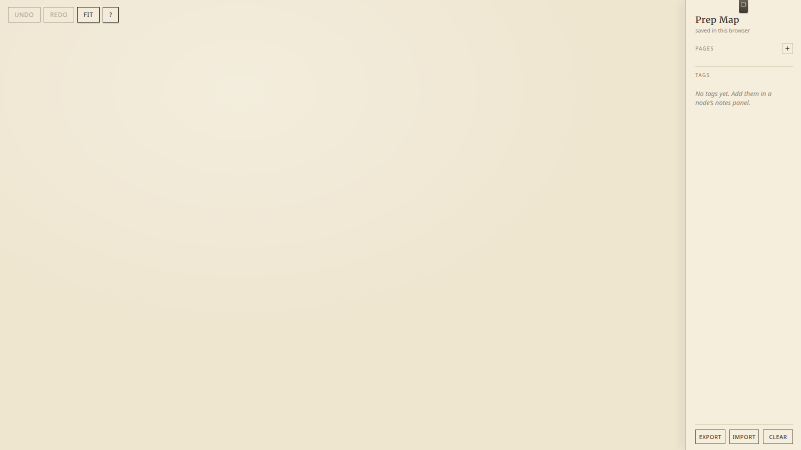
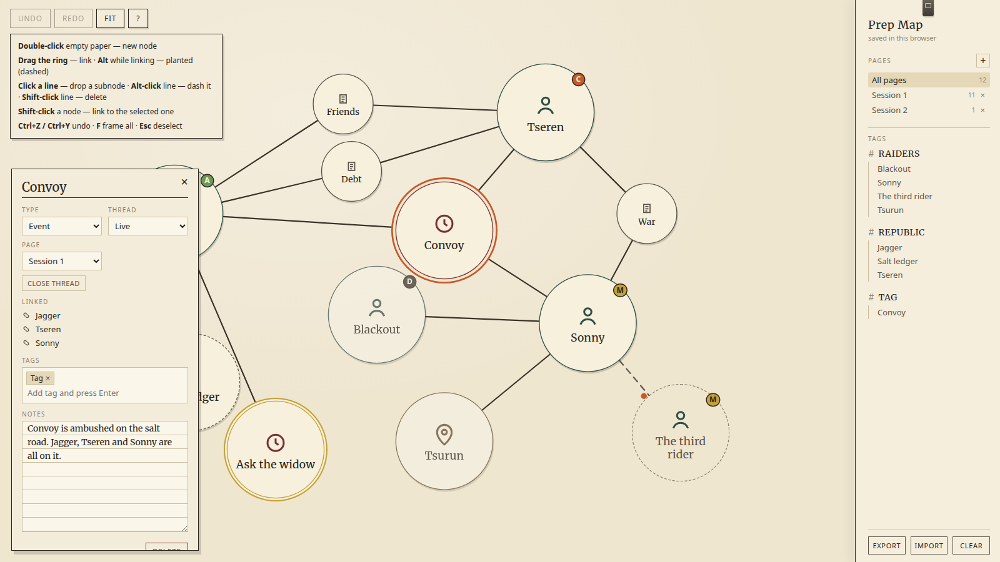
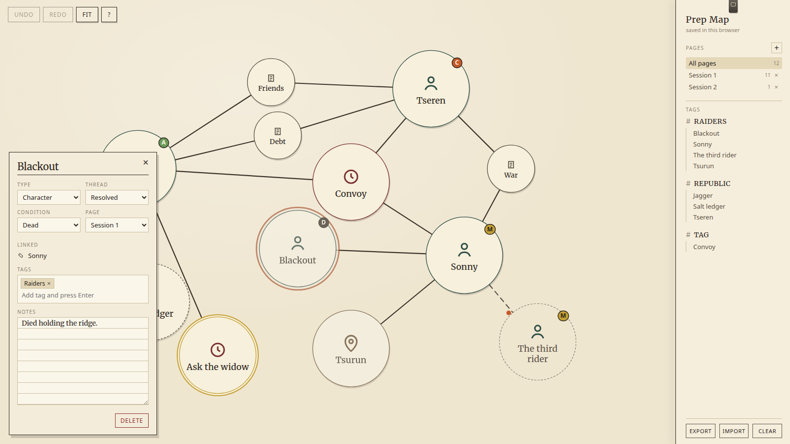
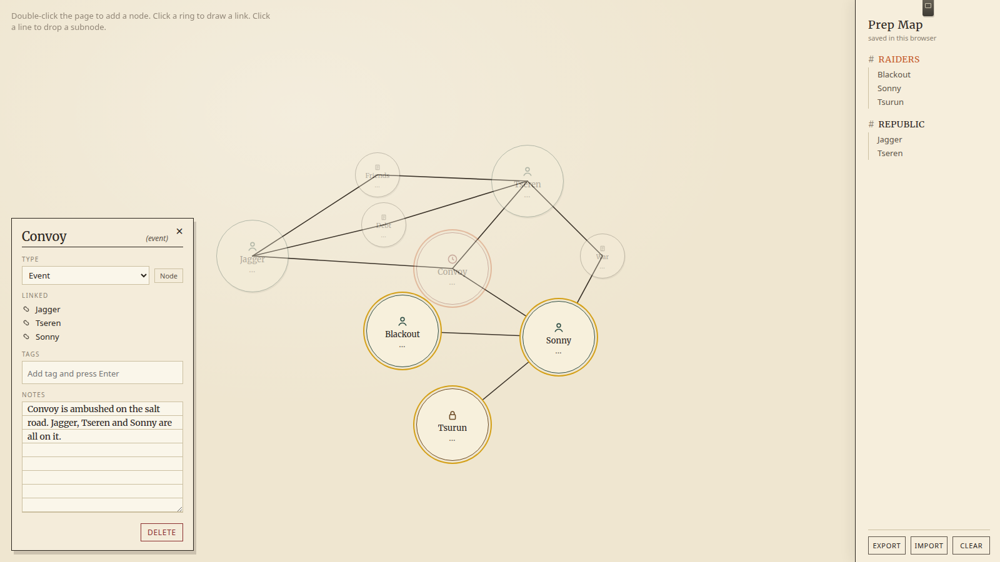
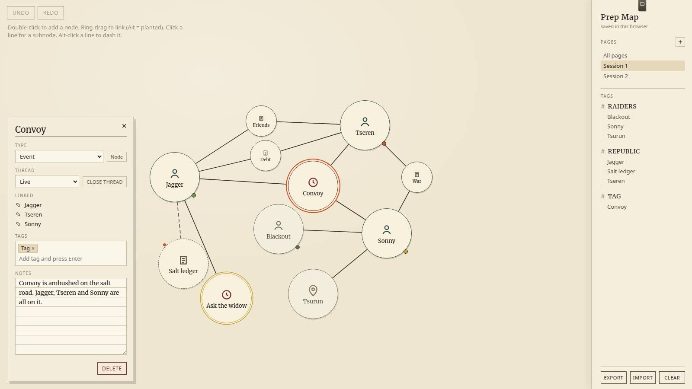
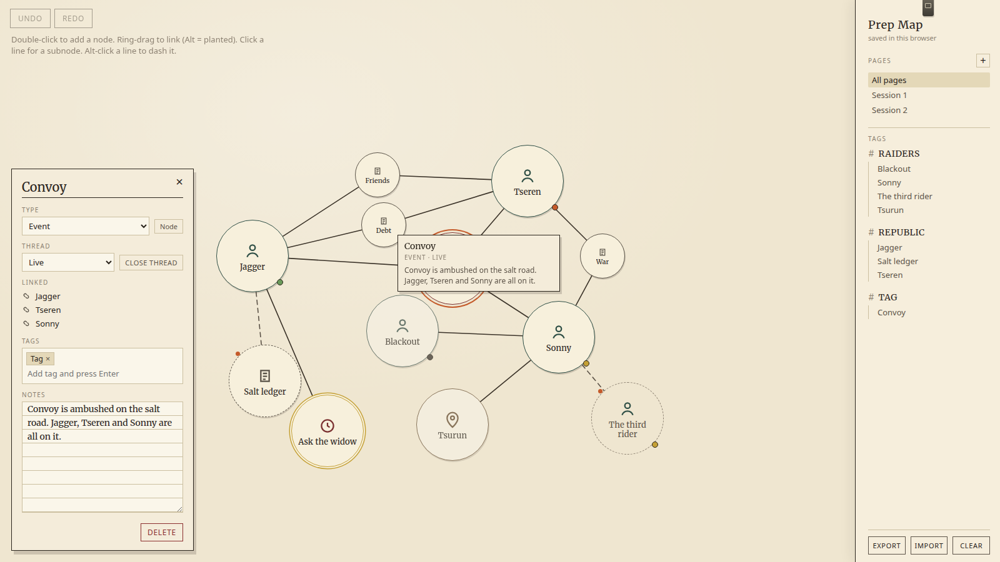
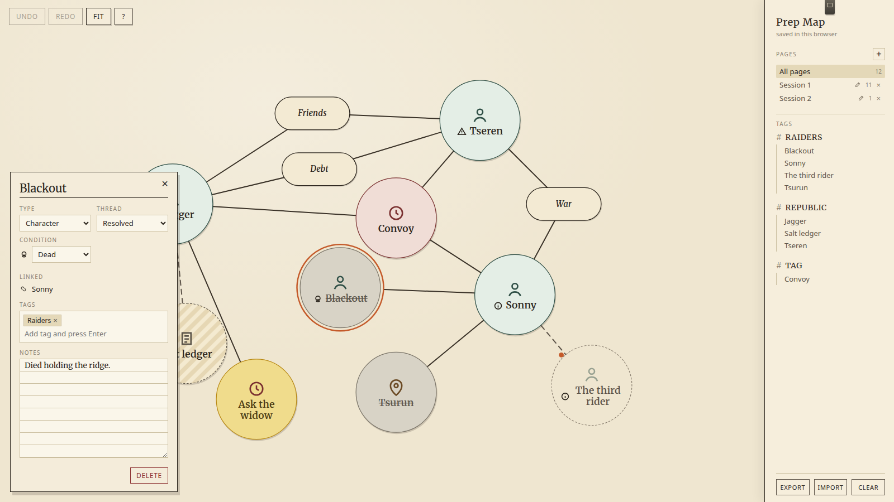

# Prep Map

A sheet of paper for campaign prep. Characters, places, events, the thread you planted three sessions ago and forgot.

Desktop browser. Wide window. Nothing leaves the machine — close the tab, open it next week, the board is still there. Phone will just tell you to use a bigger screen. That’s on purpose.

Four files: `index.html`, `styles.css`, `app.js`, this. No install, no login, no cloud.

---

## Get in

Double-click `index.html`. Or drop the folder on GitHub Pages / Netlify / `python3 -m http.server` if you want a URL.

Click **Prep Map** at the top of the right rail and name the campaign. Export uses that name.

After a Clear, add `?demo=1` to the URL to load the sample board (convoy, raiders, the third rider) so you can poke at statuses, pages, and tags without inventing a table first.

Press **?** any time for the cheat sheet.

*First open. Paper, a right rail, Undo / Redo / Fit / ? in the corner. Double-click the page.*

---

## Use-cases for a new table

### 1. First session — empty paper to a cast

You have a one-shot next week and three names on a napkin.

1. Double-click empty paper. That’s a node. Name it. Pick a type (Character, Location, Event, Faction, Note).
2. Drag the **ring** of A onto B, or select A and **Shift-click** B. A line appears.
3. Click the line if the connection itself is a beat — a debt, a war, a rumor. That drops a smaller **subnode** on the line.
4. Click a body to open the notes sheet. Type the first line the table needs to hear. Tags: type, Enter.

New nodes shove neighbours a little so they don’t sit on top of each other. **F** frames whatever is on the current page.

*A session already in motion. Help sheet top-left. Inspector on the event. Pages and tags on the right.*

### 2. Between sessions — write it down, don’t lose the thread

Click a node. The notes sheet docks bottom-left: name, type, **thread** (is this still in play?), **condition** (for people), who it’s tied to, tags, notes.

- Hover a node for a second and the first line of notes follows the cursor. Useful when the table is talking and you don’t want the sheet open.
- **Close thread** greys it and crosses the name. It stays on the board so you remember it fired.
- Gold ring = the fork they didn’t take. Dashed empty ring = a name nobody will say. Hatched dashed = you heard it, you don’t know it.

*Blackout is resolved and dead. The disc is grey. The notes still say how.*

### 3. At the table — find the gang without hunting

Stick `#raiders` on whoever deserves it. The rail lists tags.

- Click a name under a tag to jump there (canvas moves, notes open).
- Click the **#RAIDERS** header to light the whole gang and dim the rest. Click again (or select something off-tag) to drop the highlight.

*Click the tag header. Related nodes stay bright. Everything else steps back.*

### 4. After session 1 — a new sheet, same campaign

Right rail, **Pages**.

- **All pages** is the whole campaign.
- **+** is a new session (empty, already framed). Pencil renames. Clicking the name just switches.
- Paste lands on the page you’re looking at. Box-select a clique in Session 1, **Ctrl+C**, switch to Session 2, **Ctrl+V** — they’ve moved house. Links between the copied nodes come along. Links out to the rest of the board do not.
- **×** deletes that session **and everything that lived on it**. Undo if you flinch. You can’t delete the last page.

*Session 1 only. The third rider can live on Session 2 until you need the whole map.*

### 5. Glance without opening the sheet

Hover. First line of notes, type, and thread. Good when you’re mid-sentence and just need “what was the salt road again.”

*Cursor on Convoy. Excerpt under the hand. Inspector can stay closed.*

### 6. Read the board from across the table

Type sets the fill. Thread sets the ring. People get a small mark in front of the name — heart, missing, compromised, skull — so “is this NPC dead” is not the same question as “is this plot still in play.”

Subnodes are the small pills on the lines. Planted links are dashed.

*Convoy is an event. Blackout is resolved and dead. The third rider is a ghost. Ask the widow is the fork they missed.*

---

## Core features

| What | How |
|---|---|
| Infinite paper | Wheel zooms toward the cursor. Middle-mouse, right-mouse, or **Space + drag** pans. |
| Nodes | Double-click paper. Drag the middle to move. Click body → select + notes. Double-click body → rename. |
| Two sizes | Big disc = person / place / event / faction / note. Small pill = beat on a line. |
| Links | Drag the **ring** of A onto B, or select A and **Shift-click** B. |
| Planted links | Hold **Alt** while linking, or **Alt-click** a line later. Dashed. “I planted this, it hasn’t fired.” |
| Subnodes | Click a line. Automatically tied to both ends. |
| Notes sheet | Bottom left. Title, type, thread, condition, page, linked names, tags, notes. **×** closes it. |
| Tags | Type in the sheet, Enter. Rail lists them. Header highlights the set. Name focuses the node. |
| Pages | One sheet per session, plus **All pages**. Filter hides the rest. |
| Thread | Live / Resolved / Missed / Rumor / Ghost. Visual, not a delete. |
| Condition | Alive / Missing / Compromised / Dead — characters only. Does not recolour the disc. |
| Navigator | Tiny map, top-right. Dots are nodes, orange box is the view. Click or drag it. |
| Persistence | Every change writes to this browser (IndexedDB, localStorage fallback). Refresh restores. |
| Backup | **Export** JSON named after the map. **Import** replaces the open board (old files still load). **Clear** wipes; Undo will not bring a Clear back. |

---

## Keybinds and controls

| Input | Action |
|---|---|
| Double-click empty paper | New node |
| Double-click a node | Rename in place |
| Click a node body | Select and open the notes sheet |
| Drag a node body | Move (multi-select moves as a pack) |
| Drag empty paper | Selection box |
| Drag the **ring** | Start a link (rubber-band follows the cursor) |
| Drop the ring on another node | Finish the link |
| Click empty paper while linking | Cancel the rubber-band |
| **Shift-click** a node | Link it to the current selection |
| **Alt** while linking | Planted (dashed) link |
| Click a line | Drop a subnode on it |
| **Alt-click** a line | Toggle planted / solid |
| **Shift-click** a line | Delete the line |
| Wheel | Zoom toward cursor |
| Middle-drag / right-drag | Pan |
| **Space + drag** | Pan |
| Click / drag the navigator | Jump the view |
| Click a tag header | Highlight that set, dim the rest |
| Click a name in the rail | Focus that node and open notes |
| Click **×** on the notes sheet | Close it |
| **F** or Fit | Frame everything on the current page |
| **?** | Cheat sheet |
| **Esc** | Drop a half-drawn link, a selection, or the help sheet |
| **Ctrl+Z** / **Ctrl+Y** | Undo / redo |
| **Ctrl+C** / **Ctrl+X** / **Ctrl+V** | Copy / cut / paste (group lands under the cursor, on the current page) |
| **Delete** / **Backspace** | Delete the selection |
| Undo / Redo / Fit / ? | Top-left buttons, same as the keys |

If you’re typing in a field, the keys stay with the field.

---

## Full list of features

### Canvas

- Semi-endless paper; no page edges to fight.
- Zoom toward the mouse wheel, not the center of the window.
- Pan with middle mouse, right mouse, or Space-drag.
- Selection marquee on empty paper.
- Weak repulsion so a new node doesn’t land on top of an old one.
- Multi-select drag moves the pack and keeps relative layout.
- Fit / **F** frames the current page (switching pages does this for you).
- Mini-map navigator: node dots + current-view box.
- Desktop-only gate on a narrow window.

### Nodes

- Create by double-click on empty paper.
- Rename by double-click on the node, or in the notes sheet.
- Types: Character, Location, Event, Faction, Note — each with its own icon and fill.
- Two visual sizes: large discs and small line-pills (subnodes).
- Subnodes are the same data model, just smaller and born on a link.
- Drag anywhere on the body to reposition.
- Click body selects and opens the inspector; tag-group highlight clears if the new selection isn’t in that tag.
- Unread / new-node cue until you’ve opened it.

### Thread and condition (Pathologic-style status)

- **Live** — still in the stew.
- **Resolved** — grey fill, name crossed. **Close thread** does this without deleting.
- **Missed** — gold ring. The fork the table didn’t take.
- **Rumor** — dashed outline, hatched fill. Heard, not known.
- **Ghost** — empty dashed ring. A name nobody will say.
- Character **condition** is a separate mark: alive, missing, compromised, dead.
- Condition does not override type colour. Thread does not mean “the NPC died.”

### Links

- Ring-drag from A to B with a live rubber-band from the rim to the cursor.
- Shift-click from a selected node to another.
- Direct line with no subnode is allowed.
- Click the line to insert a subnode already tied to both ends.
- Alt while creating, or Alt-click later, marks a planted (dashed) support.
- Shift-click a line deletes it.
- Esc or a click on empty paper kills a half-drawn rubber-band so it does not linger.
- Edges render under nodes so a highlight never hides a disc.

### Notes sheet (inspector)

- Docks bottom-left; **×** closes it.
- Title field, type, thread, condition (characters), page assignment.
- Kind pill + **Close thread**.
- Linked-node list; click a name to jump.
- Tag chips with remove; type + Enter to add.
- Ruled notes field; the sheet grows toward the toolbar before it scrolls.
- Delete in the sheet removes the whole selection, not only the visible node.

### Hover

- Pause on a node: title, type, thread, first line of notes under the cursor.
- Does not steal the click. Good at the table.

### Pages / sessions

- Many named sheets plus an **All pages** view.
- New page starts empty and framed.
- Rename with the pencil; a plain click only switches.
- Delete page removes its nodes (undoable). Last page cannot be deleted.
- Inspector can move a node between pages.
- Paste targets the page you are looking at.

### Tags and rail

- Free-form tags on any node.
- Rail groups nodes under each tag.
- Click header → highlight members, dim the rest.
- Click a listed name → pan, comfortable zoom, open notes.
- Selecting an untagged / other-tag node drops the group highlight.
- Rename the map in the rail header; that name is the Export filename.

### Edit and history

- Undo / Redo buttons and **Ctrl+Z** / **Ctrl+Y**.
- Copy / cut / paste of a selection, connections inside the group preserved.
- Paste offset under the cursor so the clone is visible.
- Delete / Backspace on a selection.
- One undo unit per rename session, not per keystroke.

### Persistence and files

- Auto-save after every change.
- Restore on the next visit to the same origin.
- IndexedDB primary, localStorage fallback.
- Schema migration so older boards still open.
- Export / Import JSON.
- Clear the board (export first; Clear is not on the undo stack).
- `?demo=1` reseeds the sample campaign after a wipe.

### Help and chrome

- **?** overlay with the gestures you will actually use.
- First-run hint on empty paper.
- Toasts for export / import / destructive actions.
- No account, no network required after the files are on disk.

---

Switch computers? Export on this one, Import on that one.

Made by [Grok](https://grok.com), built by xAI.
